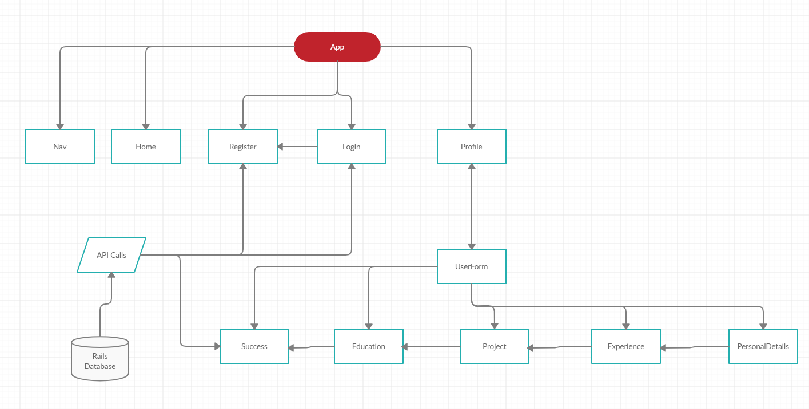

# Resume Creator
This application will allow you to create resumes using a multi-step form and add the created resumes to a database.

# Installation
Use the package manager npm in react_resume_frontend to install the resume creator.

```bash
npm install
```

# Usage
First create an account and log in.
From the profile page you can begin creating your own resume.

# Roadmap
In the future I would like to add:
* User Search Functionality
* Changing Templates
* References column
* Convert class components to functions
* Material Ui collapse on resume list

# WireFrames

## FrontEnd


## Backend
